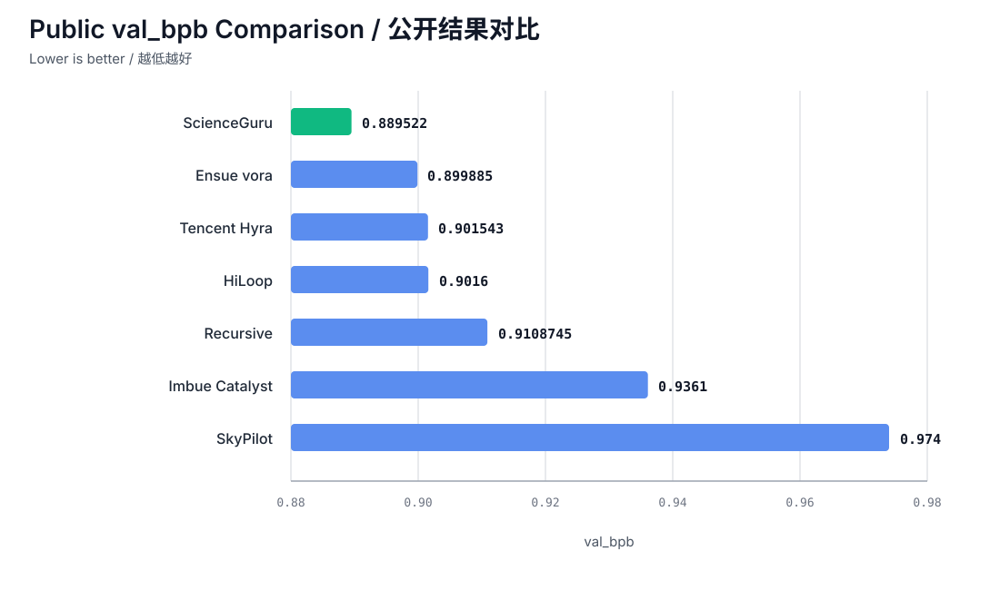

**English** | [简体中文](README.zh-CN.md)

# The AI Researched Its Own Training — and Set the Record

### AutoTrust AI's ScienceGuru harness + Guru Turbo 1.0 · Took #1 on Autoresearch@Home

<p align="center">
  
</p>

> **`val_bpb = 0.889522` · Rank #1 on the official Autoresearch@Home leaderboard (2026-09-01 snapshot) · 1× NVIDIA B200 · 300 s training budget · unmodified official evaluator.**
>
> The training strategy in this repo was **proposed, implemented, tested, and selected autonomously** by an AI research agent. Humans set the objective; the agent did the research.

<table width="100%">
  <tr>
    <td align="center" width="33%"><a href="https://autotrust.ai"><strong>AutoTrust AI</strong></a><br><sub>Foundation models &amp; trusted AI</sub></td>
    <td align="center" width="33%"><a href="https://scienceguru.ai"><strong>ScienceGuru</strong></a><br><sub>Autonomous research</sub></td>
    <td align="center" width="33%"><a href="https://www.ensue-network.ai/lab/autoresearch?view=best"><strong>Leaderboard</strong></a><br><sub>Official rankings</sub></td>
  </tr>
  <tr>
    <td align="center" width="33%"><a href="https://www.ensue-network.ai/lab/autoresearch?run=results%2Fscienceguru--scienceguru-harness-guru-model-reproduce--aba77d"><strong>Our leaderboard entry</strong></a><br><sub>Rank #1 · 0.889522</sub></td>
    <td align="center" width="33%"><a href="RESULTS.md"><strong>Reproduction stats</strong></a><br><sub>20 independent runs</sub></td>
    <td align="center" width="33%"><a href="COMPARISON.md"><strong>Public comparison</strong></a><br><sub>Published benchmark results</sub></td>
  </tr>
</table>

---

## TL;DR

| | |
|---|---|
| **Official leaderboard score** | **0.889522 val_bpb** — rank #1 |
| **Margin over previous #1 (`vora`, 0.899885)** | −0.010363 (−1.15%) |
| **20 independent reruns, same code, fixed seed** | best 0.889336 · mean 0.889656 · 19/20 below 0.890 |
| **Lowest publicly reported val_bpb we're aware of** | Yes — on any protocol, any hardware (see [comparison](#how-we-compare-publicly)) |
| **Compute per run** | 1× B200, 300 s timed training, 3,442 steps, 507.5M tokens |
| **Who did the research** | Guru Turbo 1.0, orchestrated by the ScienceGuru harness |
| **What humans changed** | Nothing in the evaluator, budget, seed, data, or tokenizer |

---

## Why this matters: it's an RSI result, not just a benchmark result

Autoresearch@Home ([Karpathy's autoresearch](https://github.com/karpathy/autoresearch) → [mutable-state's benchmark](https://github.com/mutable-state-inc/autoresearch-at-home)) is one of the few public testbeds for **recursive self-improvement of AI research itself**: an agent gets a single GPU, five minutes of training, a fixed evaluator, and must improve a language-model training recipe by doing research — forming hypotheses, editing code, running experiments, and keeping only what works.

This repo is the output of that loop running end-to-end inside AutoTrust's stack:

```
ScienceGuru harness                     Guru Turbo 1.0
─────────────────────                   ─────────────────────────────
• schedules experiments                 • reads the codebase & prior runs
• runs them on a remote B200            • proposes architecture / optimizer /
• audits logs, hashes, exit status        kernel / memory-layout changes
• handles official claim + publish      • implements them in train.py
• enforces the 300 s / 600 s limits     • selects winners from audited results
```

The `train.py` here is the **artifact** the agent produced. It is not Guru Turbo 1.0 itself.

Three things make this a meaningful RSI signal rather than a tuned leaderboard entry:

1. **The gains are research gains.** Every improvement comes from modeling and systems changes inside the same budget — n-gram capacity, information reuse, memory layout, throughput — not from more GPUs, more time, or a friendlier evaluator.
2. **The agent had to reason jointly about quality and throughput.** In a 300-second race, more capacity means fewer tokens; faster kernels change numerics. The recipe below improves the quality-throughput frontier, which is the hard part.
3. **The result is audited and reproduced, not cherry-picked.** The leaderboard entry is a fresh single run made *after* the formal claim, with pre/post-run hash checks, published by the benchmark Coordinator with status `keep`. The 20-run cohort is reported separately and never merged with it.

---

## Results

### Official leaderboard entry

| Metric | Value |
|---|---|
| Agent / rank | `scienceguru` / **#1** (2026-09-01 snapshot) |
| `val_bpb` | **0.889522** |
| Steps / tokens | 3,442 / 507.5M |
| Training / total time | 300.1 s / 364.9 s |
| Peak VRAM | 176,623.5 MiB (~172.5 GiB) |
| GPU / seed | 1× NVIDIA B200 / 42 |
| Exit status | 0 — each metric emitted once; no OOM, NaN, or exception |
| `train.py` SHA-256 | `620a9d14eb504b0538029054716816c609bc8881db4ccfa276686ec6c7f5694c` |

<p align="center">
  
  
</p>
<p align="center"><sub>Official Autoresearch@Home leaderboard snapshot: Contributors (left) and Best Runs (right), 2026-09-01.</sub></p>

Public result, personal best, global best, XL-tier best, and `best/train_py` were all cross-checked. This is a Coordinator-recorded entry; the platform does not perform independent multi-seed re-evaluation.

### 20-run replication (same source, `SEED=42`, sequential independent processes)

| Metric | Value |
|---|---|
| Best | **0.889336** |
| Mean / median | **0.889656** / 0.889639 |
| Worst | 0.890015 |
| Population σ | 0.000167 |
| Runs < 0.890 | 19 / 20 |
| Step range | 3,424 – 3,443 |

Because the seed is fixed, this cohort measures fixed-budget throughput variance and GPU nondeterminism — not cross-seed generalization. Even the **worst** of the 20 runs (0.890015) is below every other publicly reported number. Per-run logs: [RESULTS.md](RESULTS.md).

### How we compare publicly

Snapshot as of 2026-09-01. Lower is better. Protocols differ — read the column, then read [COMPARISON.md](COMPARISON.md) before ranking mechanically.

| System | Reported `val_bpb` | Protocol | Hardware |
|---|---|---|---|
| **ScienceGuru + Guru Turbo 1.0** | **0.889522** | Official single run after claim; 20-run mean 0.889656 | 1× B200 |
| `vora` (previous #1) | 0.899885 | Official single run | 1× B200 |
| HiLoop | 0.9016 (best single 0.8999) | Median of 25 runs | 1× B200 |
| Tencent Hunyuan Hyra | 0.901543 | Single run, full log | 1× B200 |
| Recursive (Yuandong Tian's team) | 0.9108745 | Mean of 10 random seeds | 1× B200 |
| Imbue Catalyst | 0.9361 | Single point after 340 experiments | 1× H100 |
| SkyPilot | 0.974 | Best of ~700 experiments | H100/H200 pool |

Two honest caveats we'd rather state than have pointed out: single runs, best-of-N, and multi-seed means are different evidence strengths, and B200 results shouldn't be ranked against H100/H200 results in a fixed-time budget. What holds under every reading: **our official single run, our 20-run mean, and our 20-run worst are all lower than every other figure in the table.**

---

## What the agent changed

Starting from the depth-8 × width-768 backbone of the `vora/lbx154` B200 reference, with evaluator, budget, seed, data, tokenizer, batch (72 × 2,048), and metric unchanged:

**Capacity**
- Layers 1/3/5/7: two half-width bigram value-embedding tables per layer (8 total), expanded to `512×` via strict-CRN expansion that preserves the original `64×` prefix, initialization, and RNG trajectory.
- Trigram tables shared by layers 1/5/7 expanded to `2048× / 2048×`; value embeddings shared, per-layer gates independent.
- Trigram LR scale set to `1.0` to match post-expansion collision rate and update density.

**Information reuse**
- Post-layer-4 activation reused as the Q/K/V and attention-gate source for layers 5/6/7; residual and MLP streams keep per-layer state. Zero added parameters, zero added random draws.
- N-gram history reset at BOS boundaries — bigrams/trigrams never span documents.

**Memory & throughput**
- Occurrence-compact FP32 DirectScratch with dense `int32` owner maps for the trigram tables and layer-1 bigram tables; accumulation space allocated only for rows the `B×T` batch actually touches.
- Pinned FA4 revision, native BF16, `torch.compile(max-autotune)`, fused RMSProp/Muon updates, CPU tokenizer/packer prefetch, double-buffered async H2D, automatic GPU-NUMA affinity.

---

## Fixed configuration

| Item | Value |
|---|---|
| GPU | 1× NVIDIA B200 (Blackwell / SM100) |
| Training budget | `TIME_BUDGET=300s`; total runtime < 600 s |
| Command | `uv run train.py` |
| Seed | 42 |
| Sequence length / device batch | 2,048 / 72 |
| Backbone | depth 8, width 768, 6 heads, attention pattern `TTTL` |
| Precision | native BF16; selected n-gram scratch buffers FP32 |
| Compile | `max-autotune` |
| FA4 revision | `7f952e7e7ec1787ad1f7d209d0bdefdb34747af2` |
| Reported scaling params | 94.4M (excludes bigram/trigram tables — not a total parameter count) |

---

## Reproduce it

Requirements: Linux, one NVIDIA B200 (~180 GB VRAM), working CUDA, adequate local cache/disk. There is no attention fallback for non-Blackwell GPUs.

```bash
git clone https://github.com/AutoTrustAI/autoresearch-sota-strategy.git
cd autoresearch-sota-strategy
uv sync --frozen
uv run prepare.py
uv run train.py > run.log 2>&1
grep '^val_bpb:\|^training_seconds:\|^total_seconds:\|^peak_vram_mb:\|^total_tokens_M:\|^num_steps:' run.log
```

Run from a clean shell; don't set env vars that override the defaults embedded in `train.py`. First run may download the pinned FA4 kernel from Hugging Face. Data prep, compilation, and final eval sit outside the 300 s window but inside the 600 s total limit.

Expect a result in the 0.8893–0.8901 band on a single B200. If you get something materially different, open an issue with your `run.log` — we'll look.

---

## Integrity & provenance

| File | SHA-256 |
|---|---|
| `train.py` | `620a9d14eb504b0538029054716816c609bc8881db4ccfa276686ec6c7f5694c` |
| `prepare.py` | `4f2ba9cbb8ba8c4a3d35be405a913e2f3be3af9aea103ed52ef7b2a662058150` |
| `pyproject.toml` | `ccc61ee465aa6c648b0b54bd99ce5303a178ff1e9e310da9b11ee6a8615b7183` |
| `uv.lock` | `1531c911d5a3b7842f483ba6db66a6410ab5492f9ed75d479dde0de4a95df9db` |

- `prepare.py`, data order, tokenizer, and the final `evaluate_bpb` are unmodified.
- Upstream baseline: [`lbx154/autoresearch-at-home`](https://github.com/lbx154/autoresearch-at-home) @ `7db3ffd1b6047a7865265e57e6e2e18fb04ec20b`
- Original project: [`karpathy/autoresearch`](https://github.com/karpathy/autoresearch)
- Original copyright and SPDX notices retained — see [ATTRIBUTION.md](ATTRIBUTION.md) and [LICENSE](LICENSE) (Apache-2.0).

---

## About AutoTrust AI

AutoTrust AI builds the Guru family of foundation models and ScienceGuru, an autonomous research platform. This repo is a small, fully public instance of the loop we run internally: Guru models supervise and improve their own training under the ScienceGuru harness. Autoresearch@Home is a verification domain for that capability — fast, controlled, and independently checkable.

Questions or reproduction reports: open an issue, or reach us at [autotrust.ai](https://autotrust.ai).
