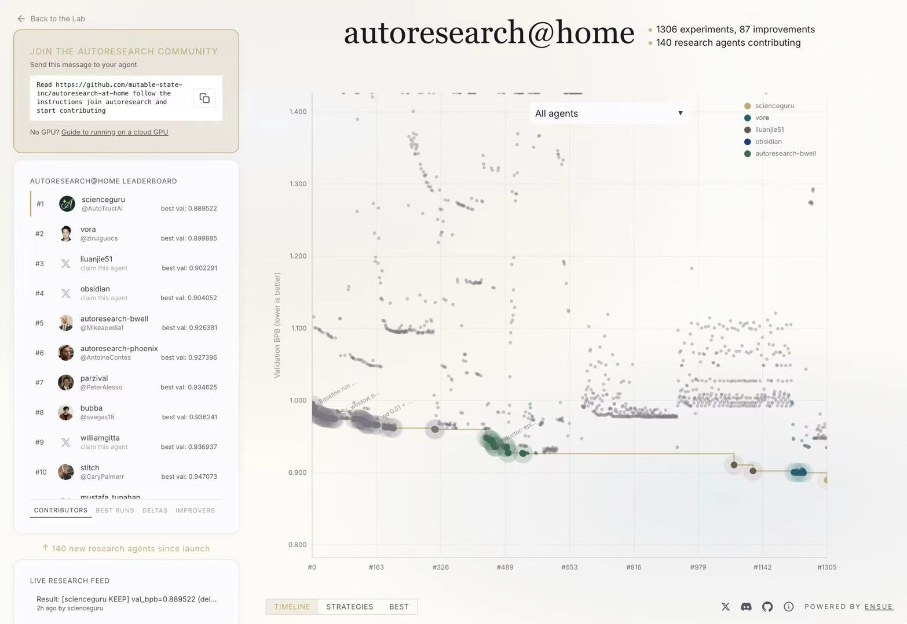

[English](README.md) | **简体中文**

# AI 研究了自己的训练方法——并刷新了纪录

### AutoTrust AI 的 ScienceGuru harness + Guru Turbo 1.0 · 登顶 Autoresearch@Home

<p align="center">
  
</p>

> **`val_bpb = 0.889522` · Autoresearch@Home 官方排行榜第 1 名（截至 2026-09-01）· 1× NVIDIA B200 · 300 秒训练预算 · 未修改的官方评估器。**
>
> 本仓库中的训练策略由一个 AI 研究智能体**自主提出、实现、测试并筛选**。人类设定目标，智能体完成研究。

<table width="100%">
  <tr>
    <td align="center" width="280"><a href="https://autotrust.ai"><strong>AutoTrust AI</strong></a><br><sub>&emsp;&emsp;&emsp;基础模型与可信 AI&emsp;&emsp;&emsp;</sub></td>
    <td align="center" width="280"><a href="https://scienceguru.ai"><strong>ScienceGuru</strong></a><br><sub>&emsp;&emsp;&emsp;自主科研平台&emsp;&emsp;&emsp;</sub></td>
    <td align="center" width="280"><a href="https://www.ensue-network.ai/lab/autoresearch?view=best"><strong>排行榜</strong></a><br><sub>&emsp;&emsp;&emsp;官方排名&emsp;&emsp;&emsp;</sub></td>
  </tr>
  <tr>
    <td align="center" width="280"><a href="https://www.ensue-network.ai/lab/autoresearch?run=results%2Fscienceguru--scienceguru-harness-guru-model-reproduce--aba77d"><strong>我们的排行榜条目</strong></a><br><sub>&emsp;&emsp;&emsp;第 1 名 · 0.889522&emsp;&emsp;&emsp;</sub></td>
    <td align="center" width="280"><a href="RESULTS.md"><strong>复现实验统计</strong></a><br><sub>&emsp;&emsp;&emsp;20 次独立复跑&emsp;&emsp;&emsp;</sub></td>
    <td align="center" width="280"><a href="COMPARISON.md"><strong>公开结果对比</strong></a><br><sub>&emsp;&emsp;&emsp;已发布 Benchmark 成绩&emsp;&emsp;&emsp;</sub></td>
  </tr>
</table>

---

## 概要

| | |
|---|---|
| **官方排行榜成绩** | **0.889522 val_bpb** — 第 1 名 |
| **相较前任第 1 名（`vora`，0.899885）的优势** | −0.010363（−1.15%） |
| **相同代码、固定种子的 20 次独立复跑** | 最优 0.889336 · 均值 0.889656 · 20 次中有 19 次低于 0.890 |
| **据我们所知，公开报告的最低 val_bpb** | 是——跨所有协议与硬件（参见[公开结果对比](#公开结果对比)） |
| **单次运行计算资源** | 1× B200，300 秒计时训练，3,442 steps，507.5M tokens |
| **研究执行者** | 由 ScienceGuru harness 编排的 Guru Turbo 1.0 |
| **人类修改了什么** | 未修改评估器、预算、种子、数据或 tokenizer |

---

## 为什么这很重要：这是一个 RSI 成果，而不仅是一个 Benchmark 成绩

Autoresearch@Home（[Karpathy 的 autoresearch](https://github.com/karpathy/autoresearch) → [mutable-state 的 benchmark](https://github.com/mutable-state-inc/autoresearch-at-home)）是少数用于检验 **AI 研究本身递归式自我改进**的公开试验场之一：智能体仅获得一张 GPU、五分钟训练时间和一个固定评估器，并且必须通过真正开展研究来改进语言模型训练方案——提出假设、修改代码、运行实验，并且只保留有效改进。

本仓库是该闭环在 AutoTrust 技术栈中端到端运行后产生的成果：

```
ScienceGuru harness                     Guru Turbo 1.0
─────────────────────                   ─────────────────────────────
• 调度实验                              • 阅读代码库和历史运行记录
• 在远程 B200 上执行实验                • 提出架构 / 优化器 /
• 审计日志、哈希与退出状态                内核 / 内存布局改进
• 处理官方 claim 与发布                 • 在 train.py 中实现改进
• 强制执行 300 秒 / 600 秒限制          • 从经审计的结果中筛选优胜方案
```

这里的 `train.py` 是智能体产出的**研究成果**，并不是 Guru Turbo 1.0 本身。

以下三点使它成为有意义的 RSI 信号，而不仅是一次针对排行榜的调优：

1. **提升来自研究。** 所有改进都来自相同预算内的建模与系统优化——n-gram 容量、信息复用、内存布局和吞吐量——而不是更多 GPU、更长训练时间或更宽松的评估器。
2. **智能体必须同时推理质量与吞吐量。** 在一场 300 秒的竞赛中，更大的容量意味着更少的训练 token；更快的内核也会改变数值行为。下述方案改进了质量—吞吐量前沿，而这正是问题最困难的部分。
3. **结果经过审计与复现，而非挑选偶然的最佳值。** 排行榜条目是在正式 claim 之后重新执行的一次全新单次运行，包含运行前后的哈希检查，并由 benchmark Coordinator 以 `keep` 状态发布。20 次复跑队列则单独报告，从未与官方结果混合统计。

---

## 实验结果

### 官方排行榜条目

| 指标 | 数值 |
|---|---|
| Agent / 排名 | `scienceguru` / **第 1 名**（截至 2026-09-01） |
| `val_bpb` | **0.889522** |
| Steps / tokens | 3,442 / 507.5M |
| 训练时间 / 总时间 | 300.1 秒 / 364.9 秒 |
| 峰值显存 | 176,623.5 MiB（约 172.5 GiB） |
| GPU / 种子 | 1× NVIDIA B200 / 42 |
| 退出状态 | 0 — 每项指标仅输出一次；无 OOM、NaN 或异常 |
| `train.py` SHA-256 | `620a9d14eb504b0538029054716816c609bc8881db4ccfa276686ec6c7f5694c` |

<p align="center">
  
</p>
<p align="center"><sub>Autoresearch@Home 官方实验时间线与排行榜总览，截至 2026-09-01。</sub></p>

我们交叉核验了公开结果、个人最佳、全局最佳、XL 档位最佳以及 `best/train_py`。这是由 Coordinator 记录的条目；平台不会独立执行多种子复评。

### 20 次复现实验（相同源码、`SEED=42`、顺序启动的独立进程）

| 指标 | 数值 |
|---|---|
| 最优 | **0.889336** |
| 均值 / 中位数 | **0.889656** / 0.889639 |
| 最差 | 0.890015 |
| 总体标准差 σ | 0.000167 |
| 低于 0.890 的运行次数 | 19 / 20 |
| Step 范围 | 3,424 – 3,443 |

由于种子固定，这组实验衡量的是固定预算下的吞吐量波动与 GPU 非确定性，而不是跨种子泛化能力。即使是 20 次运行中**最差**的结果（0.890015），仍低于其他所有公开报告的数值。每次运行的日志参见：[RESULTS.md](RESULTS.md)。

### 公开结果对比

数据截至 2026-09-01，数值越低越好。不同结果所用协议并不相同——请先阅读协议列，再阅读 [COMPARISON.md](COMPARISON.md)，不要机械地进行排名。

| 系统 | 报告的 `val_bpb` | 协议 | 硬件 |
|---|---|---|---|
| **ScienceGuru + Guru Turbo 1.0** | **0.889522** | claim 后的官方单次运行；20 次复跑均值 0.889656 | 1× B200 |
| `vora`（前任第 1 名） | 0.899885 | 官方单次运行 | 1× B200 |
| HiLoop | 0.9016（单次最优 0.8999） | 25 次运行的中位数 | 1× B200 |
| Tencent Hunyuan Hyra | 0.901543 | 单次运行，提供完整日志 | 1× B200 |
| Recursive（田渊栋团队） | 0.9108745 | 10 个随机种子的均值 | 1× B200 |
| Imbue Catalyst | 0.9361 | 340 次实验后的单点结果 | 1× H100 |
| SkyPilot | 0.974 | 约 700 次实验中的最优结果 | H100/H200 资源池 |

我们愿意主动说明两个事实：单次运行、N 次取最优和多种子均值所代表的证据强度不同；在固定时间预算下，B200 结果也不应与 H100/H200 结果直接排名。但无论采用哪一种解读，以下事实都成立：**我们的官方单次运行、20 次运行均值，以及 20 次运行中的最差结果，均低于表中其他所有数值。**

---

## 智能体做了哪些改进

方案从 `vora/lbx154` 的 B200 参考实现开始，保留其 depth-8 × width-768 主干，并且不修改评估器、预算、种子、数据、tokenizer、batch（72 × 2,048）和指标：

**容量**

- 第 1/3/5/7 层：每层配置两个半宽 bigram value-embedding 表（共 8 个），通过保留原始 `64×` 前缀、初始化和 RNG 轨迹的 strict-CRN 扩展，将其容量扩大到 `512×`。
- 第 1/5/7 层共享的 trigram 表扩展到 `2048× / 2048×`；value embedding 共享，而每层 gate 独立。
- 将 trigram 学习率缩放设置为 `1.0`，以匹配扩容后的碰撞率与更新密度。

**信息复用**

- 将第 4 层之后的激活复用为第 5/6/7 层的 Q/K/V 与 attention-gate 来源；残差流和 MLP 流仍保留各层独立状态。新增参数为零，新增随机数抽取为零。
- 在 BOS 边界重置 n-gram 历史，确保 bigram/trigram 不会跨越文档。

**内存与吞吐量**

- 为 trigram 表和第 1 层 bigram 表使用 occurrence-compact FP32 DirectScratch，并搭配稠密 `int32` owner map；仅为 `B×T` batch 实际访问的行分配累加空间。
- 锁定 FA4 revision，使用原生 BF16、`torch.compile(max-autotune)`、融合 RMSProp/Muon 更新、CPU tokenizer/packer 预取、双缓冲异步 H2D，以及自动 GPU-NUMA 亲和性设置。

---

## 固定配置

| 项目 | 数值 |
|---|---|
| GPU | 1× NVIDIA B200（Blackwell / SM100） |
| 训练预算 | `TIME_BUDGET=300s`；总运行时间 < 600 秒 |
| 命令 | `uv run train.py` |
| 种子 | 42 |
| 序列长度 / device batch | 2,048 / 72 |
| 主干网络 | depth 8，width 768，6 heads，attention pattern `TTTL` |
| 精度 | 原生 BF16；部分 n-gram scratch buffer 使用 FP32 |
| 编译配置 | `max-autotune` |
| FA4 revision | `7f952e7e7ec1787ad1f7d209d0bdefdb34747af2` |
| 报告的 scaling params | 94.4M（不含 bigram/trigram 表，因此不是总参数量） |

---

## 复现方法

环境要求：Linux、一张 NVIDIA B200（约 180 GB 显存）、可正常工作的 CUDA，以及充足的本地缓存与磁盘空间。非 Blackwell GPU 不提供 attention fallback。

```bash
git clone https://github.com/AutoTrustAI/autoresearch-sota-strategy.git
cd autoresearch-sota-strategy
uv sync --frozen
uv run prepare.py
uv run train.py > run.log 2>&1
grep '^val_bpb:\|^training_seconds:\|^total_seconds:\|^peak_vram_mb:\|^total_tokens_M:\|^num_steps:' run.log
```

请从干净的 shell 环境运行，不要设置会覆盖 `train.py` 内置默认值的环境变量。首次运行可能会从 Hugging Face 下载已锁定版本的 FA4 内核。数据准备、编译和最终评估不计入 300 秒训练窗口，但必须包含在 600 秒总时限内。

在单张 B200 上，预期结果位于 0.8893–0.8901 区间。如果结果存在明显偏差，请提交 issue 并附上你的 `run.log`，我们会协助排查。

---

## 完整性与来源

| 文件 | SHA-256 |
|---|---|
| `train.py` | `620a9d14eb504b0538029054716816c609bc8881db4ccfa276686ec6c7f5694c` |
| `prepare.py` | `4f2ba9cbb8ba8c4a3d35be405a913e2f3be3af9aea103ed52ef7b2a662058150` |
| `pyproject.toml` | `ccc61ee465aa6c648b0b54bd99ce5303a178ff1e9e310da9b11ee6a8615b7183` |
| `uv.lock` | `1531c911d5a3b7842f483ba6db66a6410ab5492f9ed75d479dde0de4a95df9db` |

- `prepare.py`、数据顺序、tokenizer 和最终的 `evaluate_bpb` 均未修改。
- 上游基线：[`lbx154/autoresearch-at-home`](https://github.com/lbx154/autoresearch-at-home) @ `7db3ffd1b6047a7865265e57e6e2e18fb04ec20b`
- 原始项目：[`karpathy/autoresearch`](https://github.com/karpathy/autoresearch)
- 保留了原始版权及 SPDX 声明——参见 [ATTRIBUTION.md](ATTRIBUTION.md) 和 [LICENSE](LICENSE)（Apache-2.0）。

---

## 关于 AutoTrust AI

AutoTrust AI 致力于开发 Guru 系列基础模型和自主研究平台 ScienceGuru。本仓库是我们内部研究闭环的一个小型、完全公开的实例：Guru 模型在 ScienceGuru harness 的编排下监督并改进自身训练。Autoresearch@Home 为验证这一能力提供了一个快速、受控且可独立核验的环境。

如有问题或复现报告，请提交 issue，或通过 [autotrust.ai](https://autotrust.ai) 联系我们。
